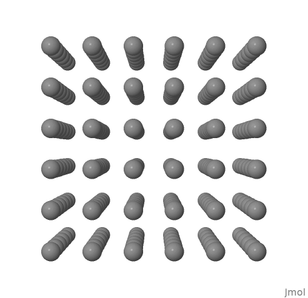
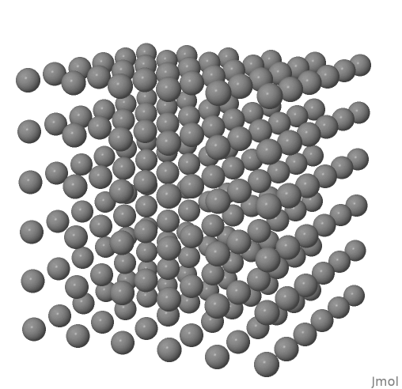
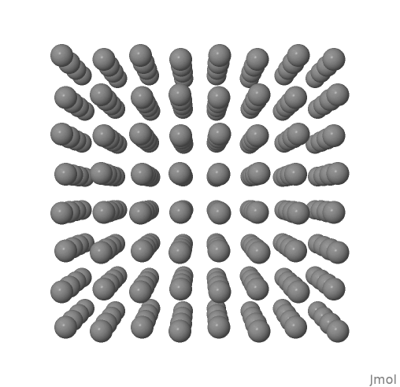
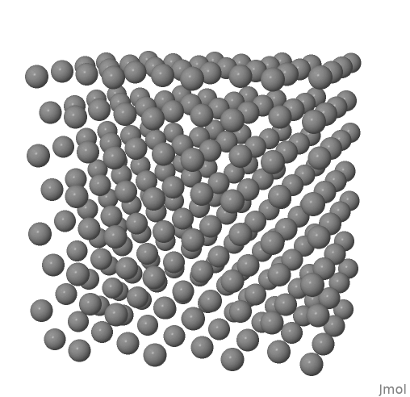

# Modelització molecular

## Molecular Dynamics Simulations

### Practise 1

<details>
<summary>Show practise 1</summary>

#### 1. Write code (preferrably a function or subroutine) to initialize the positions of particles in a sc lattice

The following function takes an integer M and a desnsiity of particles ro as input, and returns the particle array and the value of the simulation box L.

It generates an array containing the closest values to an input integer that satisfies the dimensions of an N x N x N sc lattice structure.

It prints a warning if the input integer does not satisfy the ideal dimensionality of the box, and computes the closest appropiate value.

**Sc lattice generation function**

```python
def sc_lattice(M, ro):
    N = int(
        round(M ** (1 / 3)) // 1
    )  # Nodes of the 3d cube for n particles. As it is an integer value, the rest of the particles won't be taken care of
    res = M - N ** 3
    if res != 0:
        print(
            "The number of particles does not correspond to a N x N x N cube\nThe simulation will use the closest integer value ("
            + str(N)
            + " x "
            + str(N)
            + " x "
            + str(N)
            + ")"
        )
    a = 1 / (ro ** (1 / 3))
    L = a * N
    particles = []
    for x in range(N):
        for y in range(N):
            for z in range(N):
                particles.append([x * a, y * a, z * a])
    return particles, L
```

Simmilarly, the following code returns a fcc lattice array. In this case, the condition it looks for is that the input corresponds to an 4 x N ^ 3 fcc lattice structure.

It prints a warning if the input integer does not satisfy the ideal dimensionality of the box, and computes the closest appropiate value.

**Fcc lattice generation function**

```python
def fcc_lattice(M, ro):
    N = int(
        round((M / 4) ** (1 / 3)) // 1
    )  # Nodes of the 3d cube for n particles. As it is an integer value, the rest of the particles won't be taken care of
    res = M - N ** 3 * 4
    if res != 0:
        print(
            "The number of particles does not correspond to a 4*N^3 fcc lattice\nThe simulation will use the closest integer value (4*"
            + str(N)
            + "^3)"
        )
    a = (4 / ro) ** (1 / 3)
    L = a * N
    particles = []
    for x in range(N):
        for y in range(N):
            for z in range(N):
                particles.append([x * a, y * a, z * a])
                particles.append([x * a, y * a + a / 2, z * a + a / 2])
                particles.append([x * a + a / 2, y * a + a / 2, z * a])
                particles.append([x * a + a / 2, y * a, z * a + a / 2])
    return particles, L
```

#### 2. Prepare a system of 216 particles in a sc lattice with reduced density ρ = 0.8. Visualize and generate a snapshot of the resulting configuration (call it initconf.tga).

In order to do so, we can directly call the previous function. In order to export the array as a .xyz readable file, I constructed a function that takes an array of particles and a title and outputs a .xyz file with its contents (always )

**Write to file function**

```python
def write_file(particles, filetype):
    n = len(particles)
    f = open(filetype + str(n) + ".xyz", "w")
    f.write(str(n) + "\n")
    f.write(filetype + str(n) + ".xyz\n")
    for particle in particles:
        string = ""
        for j in particle:
            string += str(j) + " "
        f.write("C " + string + "\n")
    f.close
```

Call both functions

```python
particles, L = sc_lattice(216, 0.8)
write_file(particles,"xyz/sc_lattice_")
particles, L = fcc_lattice(256, 0.8)
write_file(particles,"xyz/fcc_lattice_")
```

I then opened the generated file (fcc_lattice216.xyz) in jmol and got some snapshots from there

**Snapshots**

|                                                                                                                        |                                                                                                                             |
| :--------------------------------------------------------------------------------------------------------------------: | :-------------------------------------------------------------------------------------------------------------------------: |
|   sc lattice frontal view   |   sc lattice freehand view   |
|  fcc lattice frontal view |  fcc lattice freehand view |

#### 3. Write code (preferrably a function or subroutine) to calculate the energy of a system of N identical particles interacting through a Lennard-Jones potential..

The following function takes a particle array, a cutoff radious and the length of the simulation box which allows for conditionally apply periodic boudary conditions (L for periodic boundary consitions and 0 for non-periodic boundary conditions), and returns the value of the energy calculated with the Lennard-Jones equation.

In order to use this function, another is created to accound for boundary conditions, which is also presented below. This function works for both arrays of values or arraays of arrays.

**Energy calculation function**

```python
def calculate_energy(particles, cutoff, L):
    energy = []
    for i in range(len(particles)):
        for j in range(i + 1, len(particles)):
            dist = distance(particles[i], particles[j], L)
            if dist < cutoff:
                energy.append(4 * (1 / dist ** 12 - 1 / dist ** 6))

    return energy
```

**Distance function which accounts for periodic conditions.**

```python
def distance(p1, p2, L):
    dist = 0
    dr = []
    if type(p1) == list:
        for i in range(len(p1)):
            di = p1[i] - p2[i]
            if di > L / 2:
                dr.append(di - L)
            elif di < -L / 2:
                dr.append(di + L)
            else:
                dr.append(di)
        for i in range(len(p1)):
            dist += (dr[i]) ** 2
    else:
        di = p1 - p2
        if di > L / 2:
            return di - L
        elif di < -L / 2:
            return di + L
        else:
            return di
    dist = dist ** (1 / 2)
    return dist
```

#### 4. For the system that you have prepared with 216 particles in a fcc lattice and reduced density ρ' = 0.8:

- #### Calculate the energy of the system (in reduced units) if no periodic boundary conditions are considered.Truncate the interactions using the following cutoff radii: rc/σ = 1.5, 2, 2.5, 3.
- #### Calculate the energy of the system (in reduced units) considering periodic boundary conditions. Truncate the interactions using the following cutoff radii: rc/σ = 1.5, 2, 2.5, 3.
- #### (extra) Do the same for a system of 256 particles in a fcc lattice with the same density (ρ' = 0.8).

The following code calls the previous functions and outputs the result on the console.

**Script for computing the energies**

```python
from functions.particle_generation import sc_lattice, fcc_lattice
from functions.system_functions import calculate_energy
from functions.math_functions import vector_module


particles, L = sc_lattice(216, 0.8)
print("sc lattice for " + str(len(particles)) + " particles")
print("Lennard-Jones potential energy (no perdiodic boundary conditions)")
for i in [1.5, 2, 2.5, 3]:
    print("cutoff: ", i, " energy: ", vector_module(calculate_energy(particles, i, 0)))
print("Lennard-Jones potential energy (perdiodic boundary conditions)")
for i in [1.5, 2, 2.5, 3]:
    print("cutoff: ", i, " energy: ", vector_module(calculate_energy(particles, i, L)))


particles, L = fcc_lattice(216, 0.8)
print("\nfcc lattice for " + str(len(particles)) + " particles")
print("Lennard-Jones potential energy (no perdiodic boundary conditions)")
for i in [1.5, 2, 2.5, 3]:
    print("cutoff: ", i, " energy: ", vector_module(calculate_energy(particles, i, 0)))
print("Lennard-Jones potential energy (perdiodic boundary conditions)")
for i in [1.5, 2, 2.5, 3]:
    print("cutoff: ", i, " energy: ", vector_module(calculate_energy(particles, i, L)))

```

**Output**

```
sc lattice for 216 particles
Lennard-Jones potential energy (no perdiodic boundary conditions)
cutoff:  1.5  energy:  -497.66400000000465
cutoff:  2  energy:  -808.9076762688603
cutoff:  2.5  energy:  -855.3550813248413
cutoff:  3  energy:  -869.5351636293691
Lennard-Jones potential energy (perdiodic boundary conditions)
cutoff:  1.5  energy:  -597.1968000000053
cutoff:  2  energy:  -1058.717392592579
cutoff:  2.5  energy:  -1137.190561693361
cutoff:  3  energy:  -1167.8195394711365
The number of particles does not correspond to a 4*N^3 fcc lattice
The simulation will use the closest integer value (4*4^3)

fcc lattice for 256 particles
Lennard-Jones potential energy (no perdiodic boundary conditions)
cutoff:  1.5  energy:  -1023.5904000000145
cutoff:  2  energy:  -1112.0640000000128
cutoff:  2.5  energy:  -1211.893135802499
cutoff:  3  energy:  -1231.6085030178533
Lennard-Jones potential energy (perdiodic boundary conditions)
cutoff:  1.5  energy:  -1336.9344000000208
cutoff:  2  energy:  -1454.8992000000364
cutoff:  2.5  energy:  -1629.3751045268143
cutoff:  3  energy:  -1666.8110121889542

```

</details>
